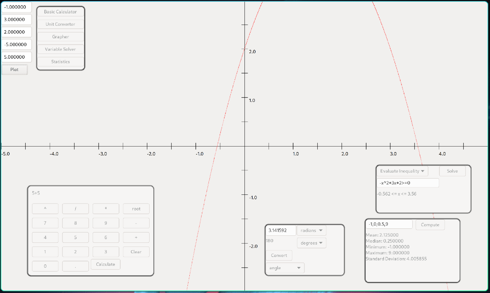

# CSE350 Group 11 Calculator Project

## Table of Contents
- [Description](#description)
- [Build](#build)
- [License](#license)

## Description
An multi-function calculator with several modules for different kinds of computations.

The 5 main modules are:
- Standard calculator
- Unit converter
- Quadratic equation plotter
- Quadratic simplifier and inequality solver
- Population statistics calculator



## Build
#### Linux:
1. Install g++ and wxWidgets\
Arch Linux: ```pacman -S gcc wxwidgets-gtk3```
2. Clone the repository
```
git clone https://github.com/bdwark/Calculator-Project.git 
cd Calculator-Project
```
3. Compile with GCC
```
g++ -o calculator BaseCalculator/*.cpp ConversionsCode/*.cpp GraphingFunction/*.cpp StatisticsCode/*.cpp UICode/*.cpp `wx-config --cxxflags --libs
```
#### Windows:


## Built with
[wxWidgets](https://wxwidgets.org/) - Cross-platform GUI library

## License
[LGPL](https://www.gnu.org/licenses/lgpl-3.0.txt)
